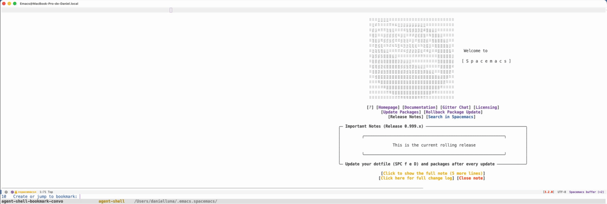

#+title: agent-shell-bookmark
#+author: Daniel Luna

Bookmark support for [[https://github.com/xenodium/agent-shell][agent-shell]] sessions in Emacs.

Jump to a bookmarked session and it will reopen automatically — switching to the buffer if already open, resuming by session ID, or falling back to the session list prompt when the session is stale.

* Installation

** straight.el

#+begin_src emacs-lisp
(use-package agent-shell-bookmark
  :straight (agent-shell-bookmark :type git
                                  :host github
                                  :repo "dcluna/agent-shell-bookmark")
  :after agent-shell)
#+end_src

** Manual

Clone the repository:

#+begin_src sh
git clone https://github.com/dcluna/agent-shell-bookmark.git
#+end_src

Add to your load path and require it:

#+begin_src emacs-lisp
(add-to-list 'load-path "/path/to/agent-shell-bookmark")
(require 'agent-shell-bookmark)
#+end_src

* Usage

In any =agent-shell= buffer, set a bookmark with:

- =C-x r m= (=bookmark-set=) — you will be prompted for a name

Jump back to it later with:

- =C-x r b= (=bookmark-jump=)
- =counsel-bookmark= (if using Ivy/Counsel)

** What happens when you jump

1. If the buffer is still open, switch to it.
2. If the buffer is gone but the session ID is known, resume the session via =agent-shell-resume-session=.  If the session ID is stale, this automatically falls back to the session list prompt.
3. If no session ID was stored, start a fresh =agent-shell= in the bookmarked project directory with the session prompt.

** counsel-bookmark integration

If =counsel= and =ivy= are loaded, =counsel-bookmark= candidates are automatically annotated with bookmark type and location.  No configuration needed — the annotation activates via =with-eval-after-load=.

| Type          | Location              |
|---------------+-----------------------|
| agent-shell   | /path/to/project/     |
| file          | /path/to/file.el      |

* Disclaimer

This package was vibe-coded with the assistance of an LLM (Claude). If that is a concern for you, please consider this before using it.

* Dependencies

- Emacs 28.1+
- [[https://github.com/xenodium/agent-shell][agent-shell]]
- (optional) [[https://github.com/abo-abo/swiper][counsel/ivy]] for annotated bookmark display
